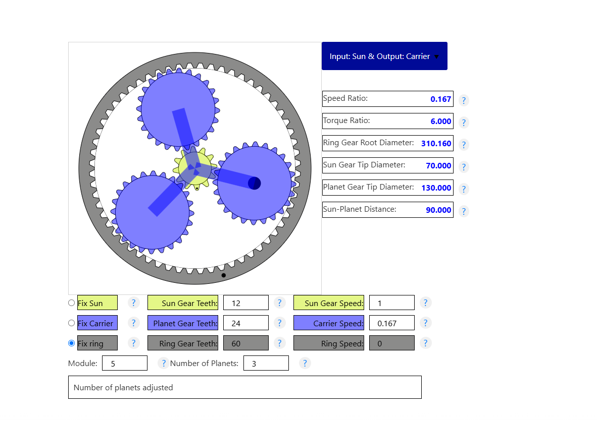
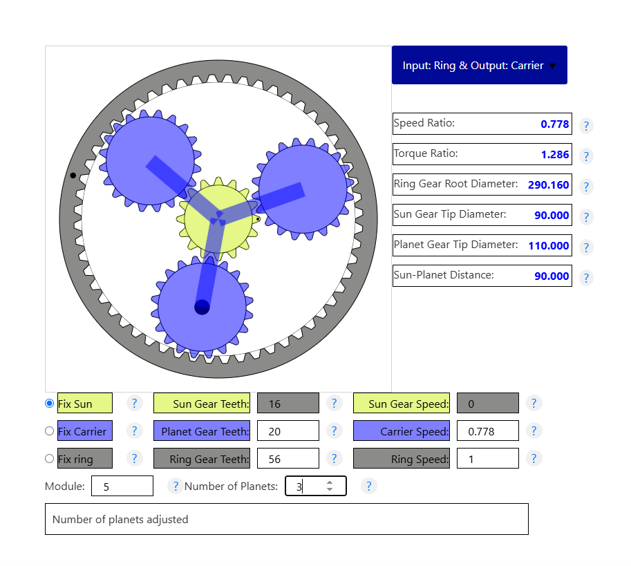

# Attempt One
First Stage
Sun	Planet	Ring
12	24	60

Second Stage
Sun	Planet	Ring
21	60

Module 1.0 – Bearings
D	d	b
13	4	5

## Issue
Failure: I need the Sun-to-Planet distance to remain the same between stages.

# Attempt Two

Second print was a sucess which is great.
the parts are a bit tight. i might want to shrink the planet diameter by 0.5mm and not 0.1mm