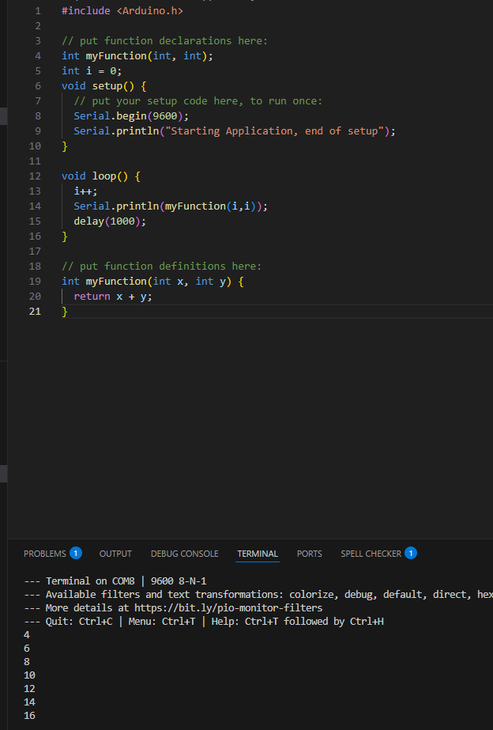
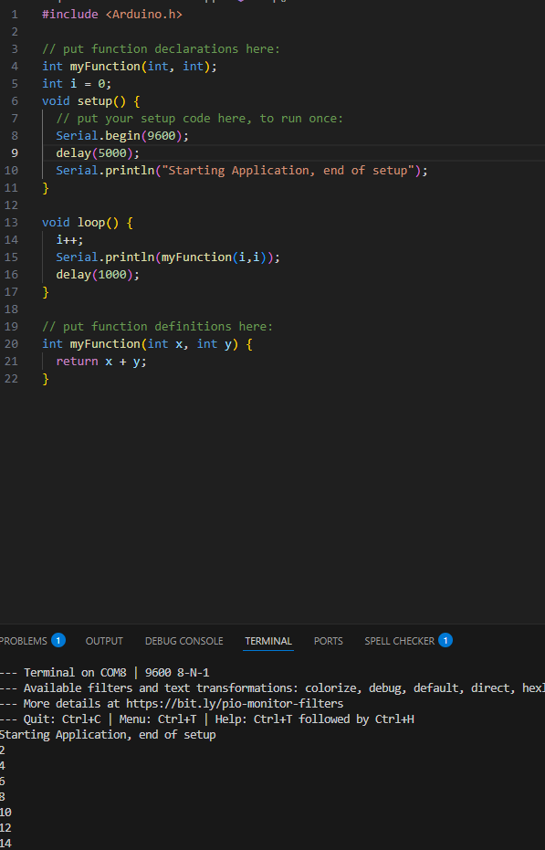

---
Given the following code and output the serial println in setup does not show up in the terminal

Problem: The serial interface is not setup before being told to write and the data is being discarded
Solutions: Wait for the interface to finish setting 
Bad solution

There is also a issue of having multiple platform.io projects withing the same parents / vscode repo.
for just run vscode in the same dir as the platform io repo