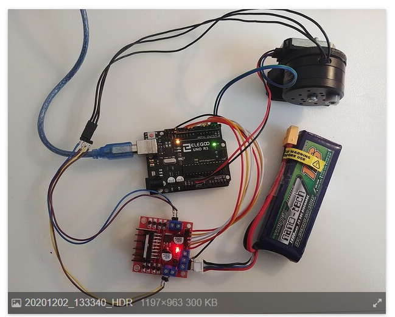

For this experiment i followed a froum post from https://community.simplefoc.com/t/3-bldc-and-stepper-foc-driver-l298n/296/90

It discuses how to used the L298N every nerd has laying around to be used for driving a bldc motor

The Electrical hook up looks like this

Note That the L298N cannot turn on and off quickly without high loss to heat therefore in our code we must adjust the pwm freq
`  driver.pwm_frequency = 4000;`
Also note i used a single 2cell lipo battery for this.

# Adding AS5600 Support
